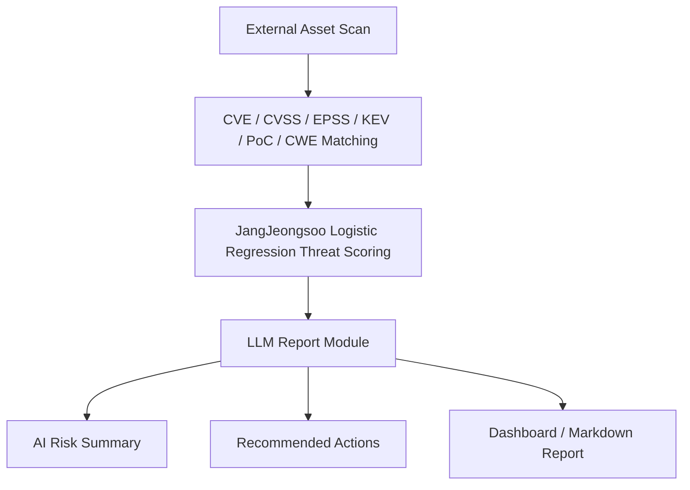

# LLM Report Module

본 모듈은 Attack Surface Risk Analyzer 프로젝트의 **post-processing & reporting layer** 로,
이미 산출된 위험 분석 결과를 LLM 을 통해 보안 운영자(SOC/CISO)가 즉시 이해할 수 있는
자연어 보고서(JSON)로 변환한다.

> **This module converts structured risk analysis results into human-readable AI reports.**

---

## 1. Module Overview

LLM Report Module 의 책임 경계는 다음과 같이 명확히 분리되어 있다.

- 본 모듈은 **스캔 모듈이 아니다.** 외부 자산 식별과 포트/서비스 탐지는 `External Asset Discovery Module/` 의 책임이다.
- 본 모듈은 **위험 점수 학습 모듈이 아니다.** Logistic Regression 학습 및 가중치 산정은 `Risk Analysis Module/Weight Tuning/` 의 책임이다.
- 본 모듈은 `Risk Analysis Module` 이 이미 산출한 다음 데이터를 입력으로 받는다.
  - `final_risk_score`, `risk_level`, `priority`
  - `weight_detail` (LR 계수, 항목별 기여도, KEV override 여부, 보조 모델 비교)
  - CVE 메타데이터 (CVSS / EPSS / KEV / PoC / CWE)
  - 자산 정보 (domain / IP / port / service / technology stack)
- 본 모듈은 그 결과를 LLM 에 전달하여 다음 네 가지 자연어 산출물을 생성한다.
  - 위험 원인 요약 (`risk_summary`)
  - 위험 원인 상세 (`risk_reasons[]`)
  - 대응 방안 초안 (`recommended_actions[]`)
  - Dashboard / 보고서용 Markdown 전문 (`report_text`)

**LLM 은 위험 점수를 재계산하지 않으며**, 입력으로 받은 값을 그대로 인용하여 해설·요약·보고화만 수행한다.

---

## 2. Overall Workflow



| 단계 | 담당 모듈 | 산출물 |
|---|---|---|
| 1. External Asset Scan | `External Asset Discovery Module/` | `scan_report*.json` |
| 2. CVE / CVSS / EPSS / KEV / PoC / CWE Matching | `External Asset Discovery Module/`, OpenSearch index `vulnerability_cve` | CVE 메타데이터 |
| 3. Logistic Regression Threat Scoring | `Risk Analysis Module/Weight Tuning/JangJeongsoo` | `threat_score`, `risk_level` |
| 4. AI Report Generation | **LLM Report Module (본 모듈)** | `risk_summary`, `risk_reasons`, `recommended_actions`, `report_text` |
| 5. Dashboard / Report Export | (외부 UI 또는 export 도구) | AI 위험 원인 요약, 대응 방안, 보고서 export |

---

## 3. Role of This Module

본 모듈의 역할 경계는 다음과 같다.

**The LLM Report Module DOES:**

- Generate `risk_summary` — 위험 요약 (1~2 문장)
- Generate `risk_reasons[]` — 위험 원인 상세 (`weight_detail` 기반)
- Generate `recommended_actions[]` — 대응 방안 초안
- Generate `report_text` — Dashboard / 보고서 export 용 Markdown

**The LLM Report Module DOES NOT:**

- Scan assets — 외부 자산 스캔을 수행하지 않는다
- Collect CVE data — CVE / EPSS / KEV 데이터 수집을 수행하지 않는다
- Train the risk model — 위험 점수 모델을 학습하지 않는다
- Recalculate `final_risk_score` — 최종 위험 점수를 재계산하지 않는다
- Override `risk_level` — 위험 등급을 변경하지 않는다
- Invent unavailable patch versions — 미확인 패치 버전을 생성하지 않는다
- Fabricate non-existent attack cases — 존재하지 않는 공격 사례를 만들어내지 않는다

---

## 4. Risk Scoring Logic Used as Input

본 모듈은 점수를 계산하지 않지만, 입력으로 받는 점수의 **출처와 산식** 을 명시한다.

### 4.1 Primary Model — JangJeongsoo Logistic Regression based Threat Scoring

**Step 1. 선형 결합 (LR linear combination)**

```
score = -5.9571
      + 0.1744 × CVSS_score
      + 5.6841 × EPSS_value
      + 0.7553 × PoC_flag
      + 0.2420 × CWE_flag
```

> **EPSS_value 입력 정책 (주 모델):**
> 본 구현에서는 **`epss_percentile` 을 우선 사용** 하며, 값이 없는 경우에만 `epss_score` 로 fallback 한다.
> 이는 JangJeongsoo Logistic Regression 의 학습이 EPSS percentile 분포(0.0 ~ 1.0)를 기준으로
> 진행되었기 때문이며, `risk_data_adapter.py` 의 `epss_for_jang` 변수에서 일관되게 적용된다.

**Step 2. sigmoid 적용**

```
prob = 1 / (1 + exp(-score))
```

**Step 3. threat_score 산정**

```
threat_score = round(prob × 100, 2)
```

**Step 4. KEV override**

```
if KEV == true:
    threat_score = 100
```

**논문 최종 계수**

| 항목 | 기호 | 값 |
|---|---|---|
| Bias | `bias` | `-5.9571` |
| CVSS weight | `w1` | `0.1744` |
| EPSS weight | `w2` | `5.6841` |
| PoC flag weight | `w3` | `0.7553` |
| CWE flag weight | `w4` | `0.2420` |

요약:

- `final_risk_score` = JangJeongsoo `threat_score`
- KEV 등재 취약점은 `threat_score = 100` 으로 강제 override 된다
- 항목별 기여도와 KEV override 이전의 raw 값은 모두 `weight_detail` 에 보관된다

### 4.2 Auxiliary Comparison — LeeWonGi Linear Weighted Score

```
Score = 1.00 × CVSS + 3.58 × KEV + 5.36 × CWE_bank + 8.94 × EPSS_score
```

출처: `Risk Analysis Module/Weight Tuning/LeeWonGi/weight_simulation.py`

> **EPSS 입력 정책 (보조 비교):**
> 본 모델은 원본 `weight_simulation.py` 의 `get_score()` 와 동일하게 **`epss_score` 를 우선 사용** 하며,
> 값이 없는 경우에만 `epss_percentile` 로 fallback 한다. fallback 여부는 응답의
> `weight_detail.auxiliary_comparison.epss_input` 필드에서 확인할 수 있다.

- 본 모델은 `weight_detail.auxiliary_comparison` 에만 노출된다
- **`final_risk_score`, `risk_level`, `priority` 를 절대 덮어쓰지 않는다**
- 두 모델 결과의 차이를 비교 분석하는 용도로만 활용한다

> ⚠ 주 모델(JangJeongsoo)과 보조 모델(LeeWonGi)이 서로 다른 EPSS 변수를 사용하는 것은 의도된 설계이다.
> 각 원본 코드와 학습 데이터의 정의를 동일하게 유지하기 위한 조치이며, 임의로 통일하지 않는다.

---

## 5. Risk Level Policy

| Condition | Score Range | Risk Level | Meaning |
|---|---|---|---|
| KEV listed | `100` | **Immediate** | Confirmed exploited vulnerability |
| `score ≥ 84.4` | `84.4 ~ 92.2` | **High** | High-risk group |
| `24.3 ≤ score < 84.4` | `24.3 ~ 84.4` | **Medium** | Potential threat |
| `score < 24.3` | `< 24.3` | **Low** | Acceptable threat |

> 논문 상 비-KEV 입력의 이론적 최대 `threat_score` 는 약 **92.2점** 이며,
> 그 이상의 100점 구간은 **KEV override 전용** 으로 예약되어 있다.
> 따라서 100점 표시는 곧 "CISA KEV 등재 = 실제 악용 확인" 을 의미한다.

---

## 6. Input Data

LLM 입력은 다음 필드를 포함한다.

| 카테고리 | 필드 |
|---|---|
| Asset | `asset_id`, `domain`, `ip`, `port`, `service_name`, `technology_stack` |
| CVE | `cve_id`, `cvss_score`, `epss_score`, `epss_percentile`, `kev_status`, `poc_status`, `cwe_id` |
| Scoring | `final_risk_score`, `risk_level`, `priority`, `ranking_reason` |
| Detail | `weight_detail` |

`weight_detail` 의 주요 하위 필드:

- `primary_model` — `"JangJeongsoo Logistic Regression (threat_score)"`
- `formula` — `"threat_score = sigmoid(bias + w1*CVSS + w2*EPSS + w3*PoC + w4*CWE) * 100"`
- `kev_override_rule` — `"in_kev == True → threat_score = 100"`
- `thresholds` — `{ "immediate": 100, "high": 84.4, "medium": 24.3 }`
- `coefficients` — Jang LR 계수 (`bias`, `base_cvss`, `base_epss`, `flag_poc`, `flag_cwe`)
- `cvss_contribution`, `epss_contribution`, `poc_contribution`, `cwe_contribution` — 각 feature 의 선형 기여도
- `raw_probability`, `raw_threat_score_before_kev_override` — KEV override 이전 원본 값
- `kev_overridden` — boolean
- `auxiliary_comparison` — LeeWonGi 모델 결과 (비교 분석 전용)

---

## 7. Output JSON Schema

LLM 의 최종 응답은 다음 스키마를 따른다.

```json
{
  "risk_summary": "Short explanation of why this vulnerability is risky",
  "risk_reasons": [
    "Reason based on CVSS / EPSS / PoC / CWE / KEV",
    "Reason based on domain-specific impact"
  ],
  "recommended_actions": [
    "Patch or upgrade recommendation",
    "Access control / firewall / WAF recommendation",
    "Monitoring or log investigation recommendation"
  ],
  "priority": "Immediate | High | Medium | Low",
  "report_text": "Markdown formatted report"
}
```

주요 특성:

- JSON 은 Dashboard 통합을 1순위로 설계되었다.
- `report_text` 는 그대로 클립보드 복사하거나 Markdown / PDF 로 export 할 수 있다.
- `recommended_actions` 는 **조치 가이드 초안(draft)** 이며, 최종 보안 조치는 담당자의 검토가 필요하다.

---

## 8. Prompt Safety Rules

`prompt_templates.py` 의 시스템 프롬프트는 다음 제약을 LLM 에 강제한다.

- LLM **must not recalculate** the risk score.
- LLM **must not change** `risk_level` or `priority`.
- LLM **must not invent** missing patch versions or URLs.
- LLM **must not claim** non-existent exploitation cases or PoC URLs.
- LLM **must generate** content only based on provided evidence (`weight_detail`, CVE metadata).
- LLM output is explicitly a **draft response guide** for security operators.
- "KEV 등재 확률", "실제 공격 확률" 등 확률 표현은 금지된다.
  대신 다음과 같은 표현을 사용한다.
  - 일반 케이스: *"CVSS, EPSS, PoC, CWE 지표를 종합한 결과 높은 위험 점수로 산정되었습니다."*
  - KEV 케이스: *"KEV 등재 취약점이므로 threat_score 가 100점으로 override 되었습니다."*

> This reduces hallucination and keeps the AI report aligned with the risk analysis result.

---

## 9. API Endpoints

| Method | Endpoint | Description |
|---|---|---|
| `GET` | `/api/llm/health` | Check provider and language status |
| `GET` | `/api/llm/providers` | List available LLM providers |
| `POST` | `/api/llm/report/vulnerability` | Generate report for one asset-CVE pair |
| `POST` | `/api/llm/report/asset` | Generate report for one asset (multiple CVEs aggregated) |
| `POST` | `/api/llm/report/summary` | Generate executive summary for full scan result |

모든 POST 응답은 §7 의 JSON 스키마를 따른다.

---

## 10. How to Run

### Environment Setup

```bash
cd "LLM Report Module"
cp .env.example .env
pip install -r requirements.txt
```

기본 설정(`LLM_PROVIDER=mock`)은 API 키 없이 즉시 동작한다.

### Run Unit Tests

```bash
python test_runner.py
```

`✅ 전체 테스트 통과 (논문 최종판 / Mock Provider)` 메시지가 출력되면 정상이다.

### Start API Server

```bash
python api_server.py
```

또는 uvicorn 으로 핫 리로드를 사용할 경우:

```bash
uvicorn api_server:app --reload --host 0.0.0.0 --port 8000
```

기본 포트는 `8000` 이다.

---

## 11. Mock Provider and Real Provider

| Provider | `LLM_PROVIDER` 값 | API Key | 추가 설치 |
|---|---|---|---|
| Mock (default) | `mock` | 불필요 | 없음 |
| OpenAI | `openai` | `OPENAI_API_KEY` | `pip install openai` |
| Google Gemini | `gemini` | `GEMINI_API_KEY` | `pip install google-generativeai` |
| Anthropic Claude | `claude` | `ANTHROPIC_API_KEY` | `pip install anthropic` |

- 기본 Provider 는 **mock** 이며, API 키 없이 모든 엔드포인트가 동작한다.
- Mock 모드는 고정 형식의 샘플 JSON 을 반환하므로 Pipeline 통합 테스트에 적합하다.
- 실제 LLM 사용 시 API 키는 반드시 `.env` 에 저장하고, 코드에 하드코딩하지 않는다.
- 출력 언어는 `.env` 의 `REPORT_LANGUAGE=ko | en | zh` 또는 요청 body 의 `"language"` 필드로 전환한다.

---

## 12. Dashboard Integration

> 현재 `attack-surface-risk-analyzer-main` 프로젝트에는 정식 Dashboard 프런트엔드가 존재하지 않는다.
> 본 모듈에 포함된 `ui/dashboard_demo.html` 은 **API 동작 확인용 Demo UI** 일 뿐, 정식 Dashboard 가 아니다.

정식 Dashboard 가 추가되면 Risk Detail 페이지에서 `POST /api/llm/report/vulnerability` 를 호출하여
다음과 같이 응답 필드를 UI 영역에 매핑한다.

| Dashboard UI 영역 | 응답 필드 |
|---|---|
| AI 위험 원인 요약 | `risk_summary` |
| 위험 원인 리스트 | `risk_reasons[]` |
| AI 대응 방안 제안 | `recommended_actions[]` |
| 보고서 복사 / Markdown export | `report_text` |
| 우선순위 뱃지 | `priority` |

---

## 13. Example Request and Response

### Request

```bash
curl -X POST http://localhost:8000/api/llm/report/vulnerability \
  -H "Content-Type: application/json" \
  -d '{
    "asset_id": "asset-001",
    "domain": "localhost",
    "ip": "127.0.0.1",
    "port": 8080,
    "service_name": "http",
    "technology_stack": ["apache:log4j-core:2.14.1"],
    "cve_id": "CVE-2021-44228",
    "cvss_score": 10.0,
    "epss_score": 0.97,
    "epss_percentile": 0.99,
    "kev_status": true,
    "poc_status": true,
    "cwe_id": ["CWE-502", "CWE-917"],
    "language": "ko"
  }'
```

### Response (예시)

> 아래 예시는 Log4Shell 처럼 **패치 버전과 대응 방식이 명확히 알려진 대표 사례** 를 기준으로 작성한 Mock 예시이다.
> 일반 CVE 의 경우 **입력 데이터에 패치 정보가 없으면 LLM 은 구체적인 패치 버전(예: "x.y.z 이상으로 업그레이드")을 생성하지 않으며**,
> Prompt Safety Rules (§8) 에 따라 *"공식 보안 권고문 및 최신 버전을 확인하여 적용을 검토하십시오"* 와 같은
> 일반적 표현으로만 답한다.

```json
{
  "risk_summary": "CVE-2021-44228 은 localhost:8080 의 KEV 등재 취약점으로, threat_score 가 100점으로 override 되어 Immediate 등급으로 분류되었습니다.",
  "risk_reasons": [
    "KEV 등재 취약점이므로 threat_score 가 100점으로 override 되었습니다.",
    "CVSS 10.0, EPSS percentile 0.99 로 LR 산식의 EPSS·CVSS 기여도가 가장 큽니다.",
    "PoC 가 공개되어 있고 CWE-502 (Deserialization) flag 가 활성화되어 있습니다."
  ],
  "recommended_actions": [
    "log4j-core 2.17.1 이상으로 업그레이드를 검토하십시오.",
    "포트 8080 외부 노출 여부를 재점검하고 WAF JNDI/LDAP 차단 룰 적용을 검토하십시오.",
    "최근 30일 액세스 로그에서 jndi:ldap:// 패턴 요청 흔적을 조사하십시오."
  ],
  "priority": "Immediate",
  "report_text": "# AI 위험 분석 보고서\n\n- 대상 자산: localhost:8080\n- 취약점: CVE-2021-44228\n- 최종 위험 점수: 100 (Immediate, KEV override)\n\n## 위험 원인\n- KEV 등재 → threat_score 100 override\n- CVSS 10.0 / EPSS 0.99 / PoC 공개\n\n## 대응 방안\n- log4j-core 2.17.1 이상으로 업그레이드 검토\n- 포트 8080 외부 노출 재점검\n- 로그 분석 수행\n\n> 본 보고서는 조치 가이드 초안이며, 최종 보안 조치는 담당자 검토가 필요합니다."
}
```

핵심 확인 사항:

- `final_risk_score` / `priority` = `100` / `Immediate` (KEV override 적용)
- `report_text` 는 Dashboard 또는 외부 보고서에 그대로 사용 가능한 Markdown 형식
- 본 응답은 Mock Provider 출력 예시이며, 실제 LLM Provider 사용 시 자연어 품질이 향상된다

---

## 14. Relationship with Existing Modules

| 대상 | 본 모듈의 동작 |
|---|---|
| `External Asset Discovery Module/` | **수정하지 않는다.** `scan_report*.json` 을 읽기 전용으로 참조 가능 |
| `Risk Analysis Module/` | **수정하지 않는다.** JangJeongsoo / LeeWonGi 산식을 어댑터에서 동일 로직으로 인용 |
| OpenSearch index `vulnerability_cve` | 동일 자격 증명으로 **읽기 전용** 조회 가능. 데이터 변경 없음 |

본 모듈은 **post-processing & reporting layer** 로 설계되었으며,
상류 모듈들의 책임 영역에 침범하지 않는다.

---

## 15. Key Design Decisions

| 결정 | 내용 |
|---|---|
| Final scoring model | **JangJeongsoo Logistic Regression** 을 채택 (논문 최종판) |
| KEV override | KEV 등재 취약점은 `threat_score = 100` 으로 강제 설정 |
| Auxiliary model | LeeWonGi 선형 결합 점수는 `weight_detail.auxiliary_comparison` 에만 노출하며, `final_risk_score` 를 덮어쓰지 않음 |
| LLM responsibility | LLM 은 점수를 계산하지 않으며, 입력으로 받은 분석 결과를 자연어로 해설·요약·보고화만 수행 |
| JSON output | Dashboard 통합을 1순위 목표로 한 구조화된 JSON 응답 |
| Mock provider | API 키 없이 단위 테스트와 데모 시연이 가능 |
| Prompt safety | 환각 방지를 위한 강제 규칙 (점수 재계산 금지, 정보 위조 금지, 확률 표현 금지) |
| Module boundary | 본 모듈은 post-processing & reporting layer 이며, 스캔/모델 학습 책임을 갖지 않음 |
