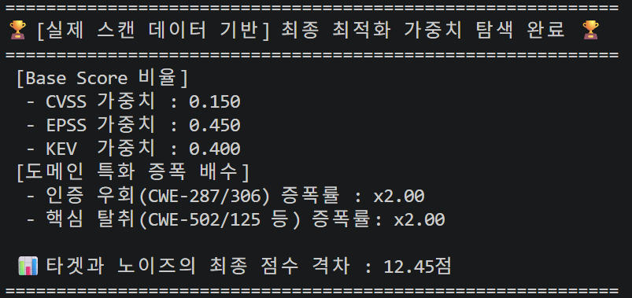

# 🛡️ 금융 인프라 특화 공격 표면 리스크 분석 시스템

본 프로젝트는 금융권 IT 인프라(IAM, VPN, MFT, Gateway 등)에서 탐지된 보안 취약점을 기술적 심각도(CVSS)뿐만 아니라, 실제 위협 데이터(KEV, EPSS)와 금융 비즈니스 로직을 결합하여 정량적으로 평가하는 시스템입니다.

---

## 🛠️ 핵심 로직 및 모듈 구성

### 1. 머신러닝 기반 가중치 최적화 (`weight_optimizer.py`)

전문가의 주관적 판단이나 단순한 감이 아닌, **적합도 함수(Objective Function)**를 통해 수학적으로 증명된 수치를 찾아내는 가중치 최적화 엔진입니다.

#### 🧬 황금 비율 도출 로직: Fitness Gap 극대화

알고리즘의 단 하나의 목표는 **"Target과 Noise의 변별력 극대화"**입니다. 우리가 반드시 조치해야 할 Target CVE들의 점수는 극대화하고, 상관없는 Noise CVE들의 점수는 최소화하여 리포트의 가독성을 높입니다.

- **적합도 격차 (Fitness Gap):** $$\text{Fitness Gap} = \text{Avg}(\text{Target Scores}) - \text{Avg}(\text{Noise Scores})$$
  > 이 격차가 커질수록 수식이 '진짜 위험한 놈'을 기가 막히게 골라내고 있다는 증거입니다. 본 모델은 최적화를 통해 **12.45점**이라는 높은 격차를 확보했습니다.

#### 🧗 알고리즘 작동 방식: Hill Climbing

알고리즘은 다음과 같은 과정을 통해 최적의 해(Global Optimum)를 찾아갑니다.

1.  **초기화:** 모든 지표(CVSS, EPSS, KEV)의 가중치를 $0.33$으로 동일하게 설정하고 탐색을 시작합니다.
2.  **무작위 변동:** 가중치를 아주 미세하게(예: $\pm 0.01$) 조정하여 새로운 조합을 만듭니다.
3.  **결과 비교:** 변경된 가중치로 계산한 **Fitness Gap**이 이전보다 커졌다면 해당 방향이 맞다고 판단하여 가중치를 업데이트합니다. (언덕을 올라감)
4.  **반복 학습:** 위 과정을 10,000번 반복하여 더 이상 격차가 벌어지지 않는 최정상 위치의 가중치를 확정합니다.

#### 📊 가중치 최적화 결과

---

### 2. 금융 리스크 평가 엔진 (`test_runner.py`)

최적화 엔진에서 도출된 가중치를 이식받아 실시간으로 리스크 점수를 산출합니다.

#### 🔬 리스크 산출 공식 및 단계

**Step 1: 기초 점수 (Base Score) 산출**
최적화 알고리즘이 도출한 지표별 가중치($W$)를 적용하여 기초 위협 수치를 계산합니다.  
$$Base = (CVSS \times 0.150) + (EPSS \times 10 \times 0.450) + (KEV\_Flag \times 10 \times 0.400)$$

**Step 2: 도메인 가중치 증폭 (Multipliers)**
금융 보안 전문가의 지식을 결합하여 특정 환경에서의 위험도를 증폭합니다.

- **인증 우회/RCE (CWE):** 금융망 취약점 유형(CWE-287, 502 등)에 대해 **x2.00** 가중치 부여
- **인프라 증폭:** VPN, MFT 등 외부 경계 자산 노출 시 가중치 부여 (x1.4)

**Step 3: 비선형 포화 스케일링 (Saturation Curve) ★**

포화 함수 (Saturation Curve):\*_
**Hyperbolic Scaling** 기법을 적용했습니다.
$$\text{Refined Score} = 10 \times \left( \frac{\text{Raw Total}}{\text{Raw Total} + 3.5} \right)$$
_(여기서 $3.5$는 변별력 조절 상수)\*

- **변별력 유지:** 점수가 아무리 높아져도 $9.1, 9.5, 9.8$과 같이 소수점 단위에서 차이가 유지됩니다. 즉, **"B가 A보다 훨씬 위험하다"**는 정보가 손실되지 않습니다.
- **현실적 상한선:** 수식이 10점에 근접할 수는 있지만, 이론적으로 무한대의 위험이 닥쳐야만 10점이 됩니다. 이는 보안 시스템의 **'마지노선'**을 제공하여 10점 만점 남발을 막아줍니다.

---

## 📊 정렬 및 시각화 원칙

단순 점수순 정렬의 맹점을 극복하기 위해 **다중 키 정렬(Multi-key Sorting)**을 수행합니다.

1.  **KEV 여부 (Primary):** 현재 실제 공격에 사용 중인 위협을 최우선 배치
2.  **Risk Score (Secondary):** 계산된 정량적 리스크 점수순 정렬
3.  **Similarity (Tertiary):** 자산 정보(CPE) 매칭 신뢰도순 정렬

---
