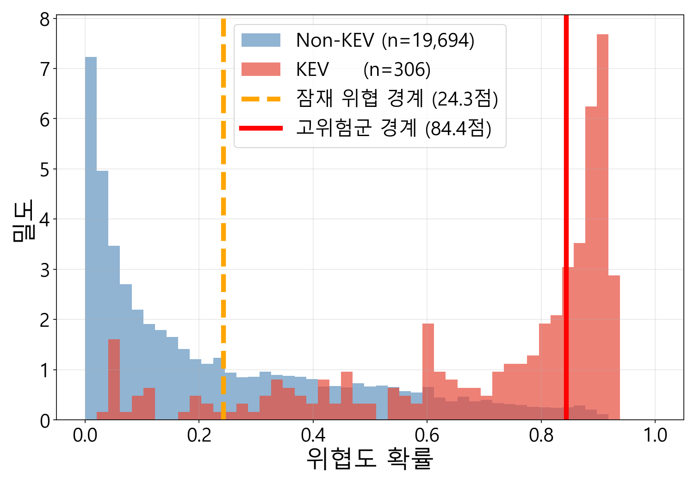
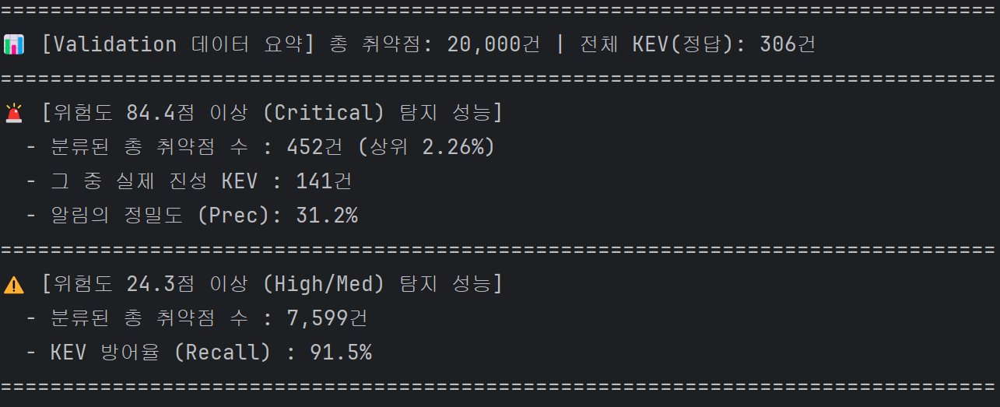
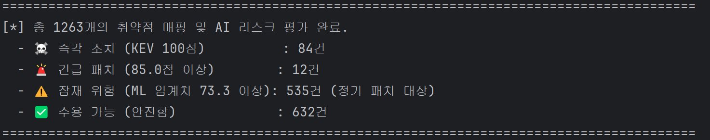

# 보안 위협도 가중치 최적화 알고리즘

CVSS score, EPSS score, PoC, CWE를 feature로 사용해 logistic regression 기반으로 최적화된 계수를 찾아냅니다.

---

## 1. 기존 DB 구조 대비 변경점

1. 더이상 CISA의 KEV를 사용하지 않습니다. 대신 VulnCheck의 KEV를 사용합니다. 기업이 운영하고 있기 때문에 등재 속도가 매우 빠르며 해당 취약점의 PoC가 깃허브나 Exploit-DB에 공개되어 있는지, 랜섬웨어 그룹이 사용 중인지, 봇넷(Botnet)이 스캐닝하고 있는지에 대한 메타데이터를 제공합니다. 또한 CISA KEV는 주로 미국 정부와 기업에 영향을 미치는 주요 취약점에 집중되어 있지만, Vulncheck은 전 세계적인 광범위한 침해 지표를 수집하므로 CISA에 등재되지 않은 수많은 실제 공격 중인 취약점을 잡아냅니다.
2. cwes, is_ransomware, has_poc 필드가 추가되었습니다. 이중 is_ransomware는 추후 최종 가중치에 포함할 여지가 있다고 생각해서 추가해 두었습니다.
3. has_poc 필드: NVD 레퍼런스의 Exploit 태그, Github, Exploited-DB, Nuclei templates까지 종합해서 True/False 값을 생성합니다.

## 2. 학습 방식

### Logistic Regression

- cvss_score, epss_percentile, has_poc, cwe를 feature로 하여 logistic regression을 실행합니다.
- Labelling은 in_kev 여부로 변경했습니다. 특정 CVE나 CWE를 기준으로 학습시 과적합의 가능성이 너무 높으며 검증의 타당성도 떨어지기 때문입니다.
- 전체 CVE data를 가지고 하는 학습을 통해 최적화된 계수를 찾아냅니다.
- recall값이 0.9 이상을 갖도록 설정했습니다.

### 가중치 산정식

$$
Score = (w_{1} \times CVSS_{score}) + (w_{2} \times EPSS_{score}) + (w_{3} \times PoC_{flag}) + (w_{4} \times CWE_{flag})
$$

이를 logistic regression으로 사용시 'bias + 가중합(Score)'을 sigmoid함수에 넣습니다. 최종적인 형태는 다음과 같습니다.

위협도 점수 = sigmoid(-5.9571 + 0.1744×CVSS + 5.6841×EPSS + 0.7553,×PoC + 0.2420×CWE)

## 학습 결과(ML_Weight_Optimizer.py)

학습시 kev weight(정답을 맞췄을 때 보상)를 10부터 10단위로 100까지 변경해가며 전체 데이터 학습 결과 성능의 차이는 거의 없는 것으로 나타났습니다.
그 중 weight가 50일 때 전체 데이터 중 recall 90%에 해당하는 지점은 확률 0.243지점이었으며, 이 임계선 이하의 확률을 가지고 있는 경우 수용 가능한 위협으로 분류했습니다. Precision이 30% 이상이면서 Recall이 가장 높은 지점은 0.844로 나타났고, 이 임계선 이상의 확률을 가지는 경우 고위험군(우선적으로 처리할 위협)으로 분류했습니다. weight 50을 선정한 이유는 두 threshold의 위치가 직관적이라고 생각해서입니다.

---
## 3. 무작위 추출 검증 결과(Validation.py)

Logistic regression을 통해 얻은 계수를 사용해 만든 위협도 점수를 사용합니다. DB에서 무작위로 2만 개의 샘플 데이터를 불러와 위협도 점수를 매기고 설정한 Threshold에 따라 분류하고 각종 수치들을 분석합니다.

---
## 4. 모의 환경 검증 결과(test_runner.py)

- Local용 AssetScanner를 사용해 만든 scan_report_simulated.json파일을 기반으로 opensearch에서 size=1000으로 검색합니다.
- 머신러닝으로 얻은 최적값을 사용해 위험도 점수를 계산합니다.
- Logistic regression의 threshold값인 0.243과 0.844를 기준으로 위험도를 나누었습니다.
- in_kev값이 true인 경우 위험도를 100으로 오버라이드하여 최우선적으로 처리하도록 하였습니다.
- 위험도 산정식상 나올 수 있는 점수는 92.2점 정도가 최대값입니다.

