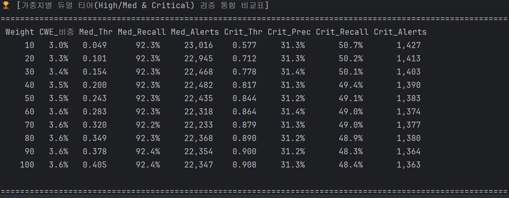
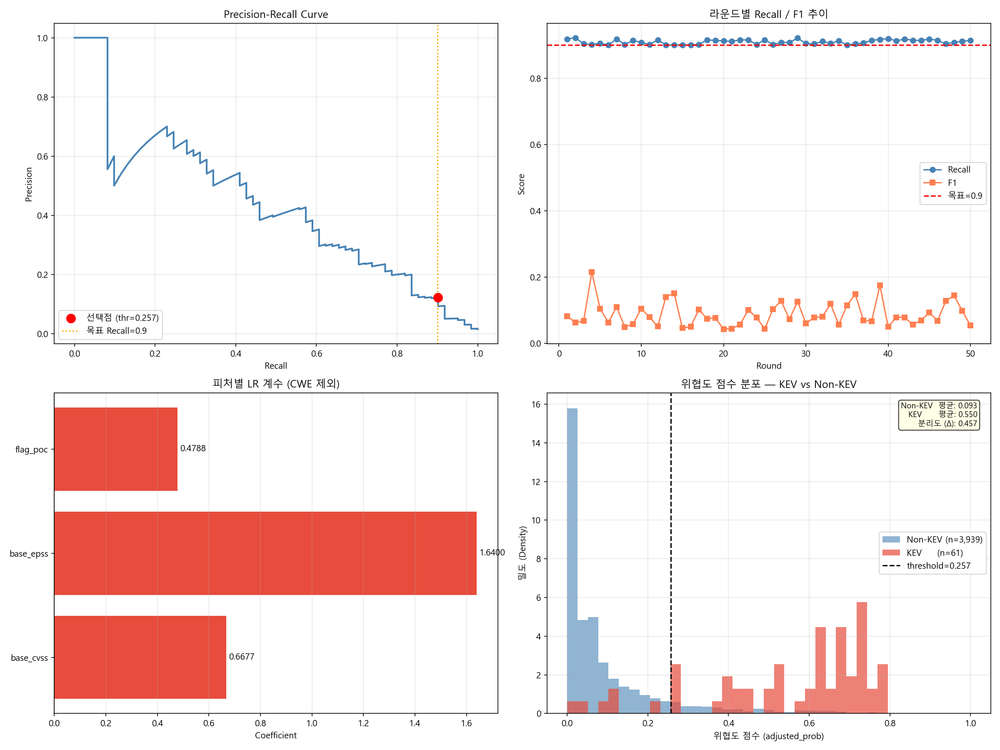

# 보안 위협도 가중치 최적화 알고리즘

CVSS score, EPSS score, PoC를 feature로 사용해 logistic regression 기반으로 최적화된 계수를 찾아냅니다. CWE는 따로 빼서 사용했습니다.

---

## 기존 DB 구조 대비 변경점

1. 더이상 CISA의 KEV를 사용하지 않습니다. 대신 VulnCheck의 KEV를 사용합니다. 기업이 운영하고 있기 때문에 등재 속도가 매우 빠르며 해당 취약점의 PoC가 깃허브나 Exploit-DB에 공개되어 있는지, 랜섬웨어 그룹이 사용 중인지, 봇넷(Botnet)이 스캐닝하고 있는지에 대한 메타데이터를 제공합니다. 또한 CISA KEV는 주로 미국 정부와 기업에 영향을 미치는 주요 취약점에 집중되어 있지만, Vulncheck은 전 세계적인 광범위한 침해 지표를 수집하므로 CISA에 등재되지 않은 수많은 실제 공격 중인 취약점을 잡아냅니다.
2. cwes, is_ransomware, has_poc 필드가 추가되었습니다. 이중 is_ransomware는 추후 최종 가중치에 포함할 여지가 있다고 생각해서 추가해 두었습니다.
3. has_poc 필드: NVD 레퍼런스의 Exploit 태그, Github, Exploited-DB, Nuclei templates까지 종합해서 True/False 값을 생성합니다.

## 학습 방식

### Logistic Regression

- cvss_score, epss_percentile, has_poc를 feature로 하여 logistic regression을 실행합니다.
- cwe는 학습 결과 모델의 변수로 유의미한 차이를 내지 못했기 때문에 제외하고, 대신 최종 산정된 sigmoid에서 보정치로 추가했습니다.
- Labelling은 in_kev 여부로 변경했습니다. 특정 CVE나 CWE를 기준으로 학습시 과적합의 가능성이 너무 높으며 검증의 타당성도 떨어지기 때문입니다.
- 2만 개의 무작위 추출된 CVE sample data를 가지고 하는 학습을 1회로 하여, seed를 변경해가며 총 50회의 학습을 통해 최적화된 계수를 찾아냅니다.
- recall(추출된 sample 중 True positive 응답의 비율)값이 0.9 이상을 갖도록 설정했습니다.

### 가중치 산정식

$$
Score = (C_{1} \times CVSS_{score}) + (C_{2} \times EPSS_{score}) + (C_{3} \times PoC_{flag})
$$

이를 logistic regression으로 사용시 'bias + 가중합(Score)'을 sigmoid함수에 넣고 0.05 x CWE_flag를 더합니다. 최종적인 형태는 다음과 같습니다.

위협도 점수 = clip(sigmoid(b + 0.6677×CVSS + 1.6400×EPSS + 0.4788×PoC) + 0.05×CWE, 0, 1)

## 학습 결과

